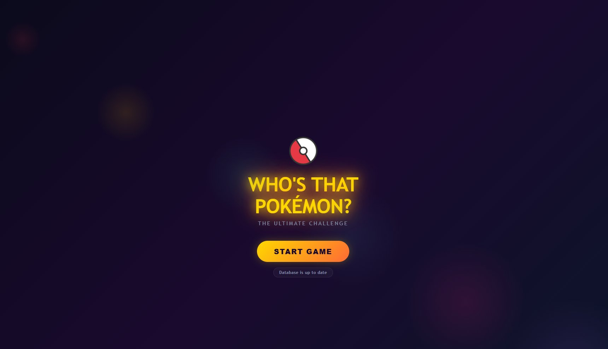
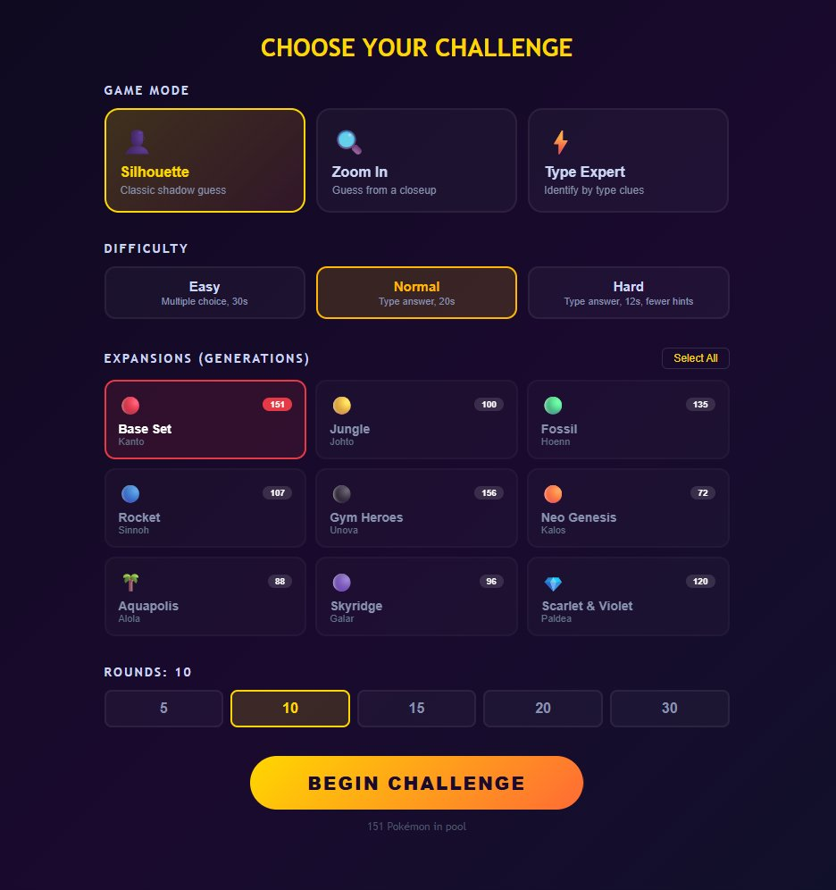
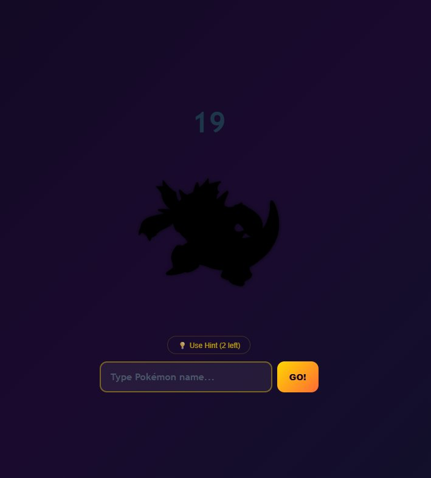
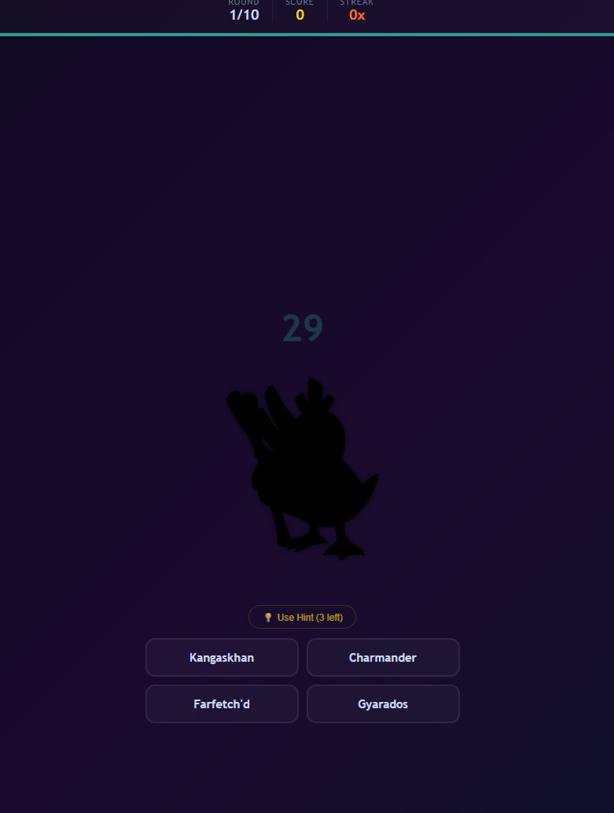

<div align="center">


<a href="#">
  
</a>

<br/>


<br/>


<br/><br/>

[](https://guess-that-pokemon-three.vercel.app)

</div>

---

## 📸 Screenshots

<table>
<tr>
<td align="center" width="50%">

<br/><b>Title Screen</b>
</td>
<td align="center" width="50%">

<br/><b>Challenge Settings</b>
</td>
</tr>
<tr>
<td align="center" width="50%">

<br/><b>Silhouette — Normal Mode</b>
</td>
<td align="center" width="50%">

<br/><b>Silhouette — Easy Mode</b>
</td>
</tr>
</table>

---

## 🎮 Game Modes

<table>
<tr>
<td align="center" width="33%">

### 👤
### Silhouette
Classic shadow outline guessing —<br/>the original TV show experience

</td>
<td align="center" width="33%">

### 🔍
### Zoom In
Extreme close-up crop —<br/>hints progressively zoom out

</td>
<td align="center" width="33%">

### ⚡
### Type Expert
No image — only type badges<br/>& Pokédex number. Masters only

</td>
</tr>
</table>

## ✨ What Makes It Unique

<table>
<tr><td>🔄</td><td><b>Auto-Sync DB</b></td><td>1,025 Pokémon offline + live PokeAPI sync for new releases. Future-proof forever</td></tr>
<tr><td>🔥</td><td><b>Streak Combos</b></td><td><code>GREAT!</code> → <code>ON FIRE!</code> → <code>SUPER EFFECTIVE!</code> → <code>LEGENDARY!</code></td></tr>
<tr><td>💡</td><td><b>Progressive Hints</b></td><td>Type reveal → First letter → Partial name fill</td></tr>
<tr><td>✨</td><td><b>Particle FX</b></td><td>Type-colored burst particles on correct guesses</td></tr>
<tr><td>📳</td><td><b>Screen Shake</b></td><td>Tactile feedback on wrong answers</td></tr>
<tr><td>⏱️</td><td><b>Dynamic Timer</b></td><td>Pulsing red bar when time runs low</td></tr>
<tr><td>🏆</td><td><b>Rank System</b></td><td>Rookie → Trainer → Gym Leader → Elite Four → Pokémon Master</td></tr>
<tr><td>📦</td><td><b>Caught Strip</b></td><td>Watch your collection grow at the bottom during each session</td></tr>
</table>

## ⚡ Quick Start

```bash
git clone https://github.com/ZeroZulu/guess-that-pokemon.git
cd guess-that-pokemon
npm install
npm run dev
```

## 🚀 Deploy

<table>
<tr>
<td align="center" width="50%"><b>▲ Vercel</b></td>
<td align="center" width="50%"><b>◆ GitHub Pages</b></td>
</tr>
<tr>
<td align="center">

Import repo at <a href="https://vercel.com/new">vercel.com/new</a><br/>→ Click <b>Deploy</b> → Done

</td>
<td align="center">

Repo <b>Settings → Pages</b> → Source: <b>GitHub Actions</b><br/>→ Auto-deploys on every push

</td>
</tr>
</table>

## 🔄 Auto-Sync Architecture

```
┌──────────────────────────────────────────────────┐
│              APP LOADS INSTANTLY                  │
│          (1,025 hardcoded Pokémon)                │
└─────────────────────┬────────────────────────────┘
                      │ background
                      ▼
┌──────────────────────────────────────────────────┐
│          CHECK PokeAPI species count             │
│   pokeapi.co/api/v2/pokemon-species/?limit=1     │
└─────────────────────┬────────────────────────────┘
                      │
             ┌────────┴────────┐
             ▼                 ▼
      count ≤ 1025       count > 1025
      ┌──────────┐    ┌────────────────┐
      │  No sync │    │  Fetch new in  │
      │  needed  │    │  batches of 10 │
      └──────────┘    └───────┬────────┘
                              ▼
                     ┌────────────────┐
                     │  Merge + auto  │
                     │  detect new    │
                     │  generations   │
                     └────────────────┘
```

## 🛠 Stack

`React 18` · `Vite` · `PokeAPI Sprites` · `Pure CSS Animations` · `Zero UI deps`

## 📊 Data

[Kaggle Pokemon Dataset](https://www.kaggle.com/datasets/vishalsubbiah/pokemon-images-and-types/data) by Vishal Subbiah · [PokeAPI Sprites](https://github.com/PokeAPI/sprites)

---

<div align="center">


**MIT License** · *Gotta guess 'em all!*

</div>
